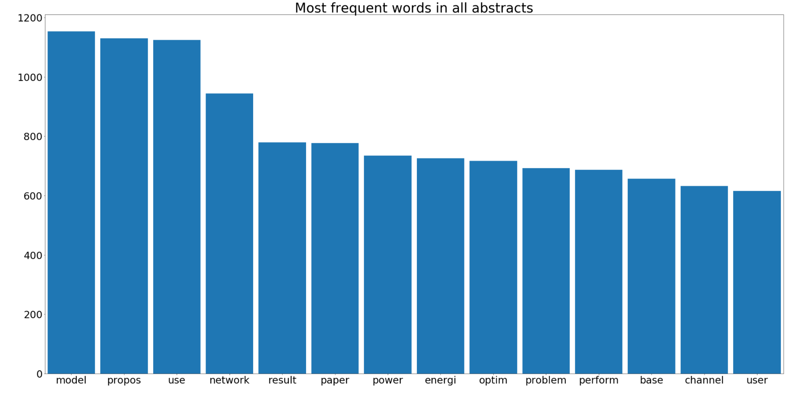
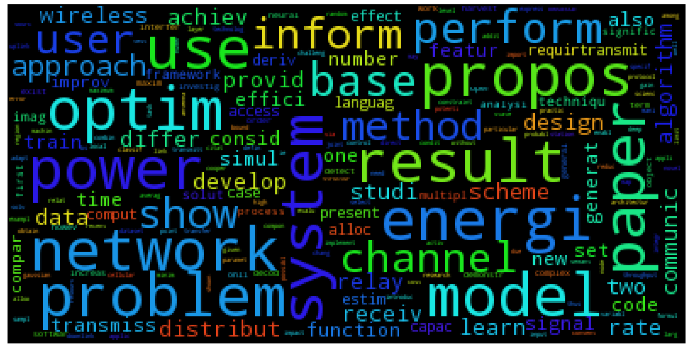

# Machine Learning Engineer Nanodegree Capstone Project
## Convolutional Neural Networks for multiclass document classification 
Natalya Rapstine
March 3rd, 2017

## I. Definition
### Project Overview
Applying to graduate school is a long and tedious process that requires a lot of preparation and research. One of the most important aspects of applying to graduate school is to find a potential advisor or research group that fits an individual interests and background. [Priceton Review](https://www.princetonreview.com/grad-school-advice/application-timeline) recommends starting to research grad schools in May and finalizing the list of prospective graduate schools in September. My goal is to shorten 5 months long research process to a few hours. This project was partly inspired by this [paper from Google](https://static.googleusercontent.com/media/research.google.com/en//pubs/archive/45530.pdf) on how YouTube recommender system that uses deep neural networks and partly by personal frustrating experience of applying to graduate school.

I aim to aid students and working professionals thinking about applying to graduate school in the Computer Science field by building a recommender system for students who are unsure of where to apply based on their current knowledge and interests. This process will automate long and tedious web search to first find schools, narrow down professors and then read through their recent publications. To build a recommender system that outputs ordered suitable professors given student's interests in a form of key words so that the student can be confident that there is a match between what research group/professor is publishing, I recast the problem as a multiclass classification problem. The successful classifier model will be trained to identify which publication belongs to which author. Then we assume that given student's interests in terms of key words input, our model will predict the most probable authors. This project focuses on building a successful classifier using Convolutional Neural Networks (CNN) against a Logistic Regression benchmark model.


**Datasets and Inputs**

The website [arXiv.org](https://arxiv.org/) provides open access to over 1 million research publications STEM fields which are suitable for my database of publications in the field of Computer Science. I gather a large dataset of openly available academic abstracts published in recent years in Computer Science field. The raw data contains abstract text with corresponding article authors' as its label.


### Problem Statement
The problem I am solving can be thought of as a supervised multiclass classification with each professor being a distinct class. The labels are the author's name and the data are the text of that author's abstract. My goal is to accurately predict what abstracts are classified to which author. I will first build a logistic regression model then compare its results with a CNN model.


### Metrics
To evaluate the performance of the benchmark and solution classifier models, I will use the [accuracy score metric](http://scikit-learn.org/stable/modules/generated/sklearn.metrics.accuracy_score.html) on the test data that the model has not seen while training.

The accuracy score computes the fraction of correctly predicted samples. The lowest possible accuracy score is 0 and the highest is 1. Accuracy is computed as follows:
$$
accuracy(y, \hat{y} ) = \frac{1}{N} \sum_i  1(\hat{y_i} = y_i)
$$
where *i* is the sample index, *y* is the true label, *y hat* is the predicted class, *N* is the number of samples, and *1* is the indicator function. 


## II. Analysis
### Data Exploration
The full dataset `articles.sqlite` contains 87,587 abstracts from 2/2012 through 2/2017. Overall, there are 107,947 authors with the article count ranging from 166 to 1. But for my benchmark and solution models, I will only use a small subset of the data, using top 10 authors with 50 or more abstracts. First, I count the number of articles per author to order them by the number of publications. For simplicity and computational time sake, `cnn.py` Python script limits the number of authors to 10 and compares logistic regression benchmark and CNN models as a proxy to larger number of classes and amount of data.

I use Pandas library to build a dataframe with one column containing the author and the second column - abstract text. In the database, we might have several authors who collaborated on the publication. So, we need to split the authors and then append the author name and abstract text into one row of a big Pandas dataframe. We end up with 1772 abstracts in the dataframe among these top 10 authors.

We can count the number of publications per author to make sure the counts correspond to what we see in the database. 


As expected, Bernhard Rumpe is the top author with 166 publications and Loet Leydesdorff is the tenth author with 96 publications in the database.

```
Rumpe, Bernhard          166
Bengio, Yoshua           137
Poor, H. Vincent         133
Zhang, Rui               123
Schober, Robert          114
Alouini, Mohamed-Slim    106
Shen, Chunhua            102
Popovski, Petar           98
Aickelin, Uwe             97
Leydesdorff, Loet         96
```


**PCA**

I also carry out Principle Component Analysis of the data to try and reduce the dimensionality of the data. However, the first two PCA components only account for about 6 percent of variance in the data. So visualizing the scatter matrix of the first two components would produce randomly distributed points with points not clustering together for a particular label. So, I work with the unreducted dataset.


### Exploratory Visualization

For each document, we count the frequency of each word stem in all abstracts and delete [English stop words](http://xpo6.com/list-of-english-stop-words/). Then combine the vocabulary of all documents and plot the frequency of word stems as a Pareto chart. The word stems are plotted in decreasing order on the x-axis with the y-axis showing the hit count of most frequent word stems. The visualization helps us get a sense of vocabulary of the corpus that classification algorithms will use to distinguish one author from another.



Thus, we see that the most frequent word stems in all abstracts are "model", "propos", "use", "network", and "result" which makes sense given that the abstracts are technical abstracts from Computer Science field that talk about modeling and results.

We can also visualize the word stem frequency as a word cloud. With a word cloud graphic, we get a visual representation of the corpus vocabulary with more frequent words plotted in larger fonts than less frequenty used. 



Again, we see word stems such as "problem", "paper", "perform", "inform", "base", "user" and in smaller fonts, "data", "time", "algorithm", "code", and "function".


### Algorithms and Techniques

**Train/Test split**

As with any machine learning application, we want to split our data into training and testing datasets. I used `StratifiedShuffleSplit` function from `sklearn.model_selection` library to split the data and labels. After splitting, the training set is 1054 samples and the testing set is 118 samples.


### Benchmark
For the benchmark model, we build a regularized logistic regression model due to its simplicity and easy interpretation. We used the one-vr-rest scheme for multiclass classification training and [Stochastic Average Gradient solver](https://hal.inria.fr/hal-00860051/document). The benchmark's performance is not great with the accuracy score on the test dataset of 0.6017.


## III. Methodology
### Data Preprocessing
In the first step, `database.py` Python script scapes abstract text and the corresponding authors' names from the website by looping over publications from February, 2017 back to February, 2012 to collect 5 years worth of abstracts and store the data in sqlite database `articles`. I store the data in sqlite database so I would only have to do this step once and then work directly with the database. The raw data needs to be preprocessed to be suitable for classification. As a standard [Natural Language Processing workflow](https://www.kaggle.com/c/word2vec-nlp-tutorial/details/part-1-for-beginners-bag-of-words) text cleaning step, I convert the text words to lower case, remove the digits and punctuation and then stem the words using Snowball Stemmer before storing preprocessed text in the database.

Working with the `articles` databse, `count_db.py` Python script separates individual authors from publications with mutliple authors and counts the number of publications per author and writes the results in sqlite table `Counts`. Next, I can sort the authors by the number of publications or filter out authors that only have a few publications.

For a CNN model, we want to make sure all the documents are the same length meanining they contain the same amount of words. The longest abstract has 319 words. So, we pad shorter documents to be the same length as the longest document. 

Instead of dealing with text directly, we want to build a vocabulary of words and then map words to index to convert text to integer vectors for input to a CNN model. We first count the words, build an index and then a mapping from index to a word. The size of our vocabulary is the total number of unique words which is 7,247 words. The input data is now converted into integer vectors with the length of 319 for each abstract.

We want to encode the labels (authors' names) as one-hot vectors to represent true labels in the CNN model. First, we convert labels to factors and then use `LabelBinarizer` function from `sklearn.preprocessing` library to convert labels to 10-dimensional one-hot vectors where each author's name is now encoded as a vector of length 10 that has 9 zeros and one value of 1. The index of 1 in the vector distinguishes one author from another. 


### Implementation
I used TensorFlow library to build a multi-layer convolutional network. The input to the network are abstract text that has been mapped to integer word vectors using the full corpus vocabulary. The first layer in a convolutional neural network is the embedding layer with a user defined embedding size of 500 to learn word embeddings. This layer maps word indices into low-dimensional vector representations.

The second layer is a convolution and pooling layer with three different filter lengths of 3, 4, and 5 that are then combined and a user defined number of filters parameter equal to 500.  The pooling filters out the maximum value for each convolution to reduce the size of the layer. During training, we use Adam Optimizer to minimize the objective function.

To prune the network and reduce overfitting, dropout is added during training that disables the neurons that are less than 0.5 probability. The last layer is fully-connected layer with the softmax output classification. 


### Refinement
For my initial solution, I built a Pandas dataframe with the word stems as columns and authors as rows. 

|          | word 1    | word 2    | word n    |
| -------- | --------- | --------- | --------- |
| author 1 | frequency | frequency | frequency |
| author 2 | frequency | frequency | frequency |
| author m | frequency | frequency | frequency |

Then I scaled the word count with frequency-inverse weighting, putting more weight on words that occur frequently within the abstract but not so frequently in the whole corpus. I used `TfidVectorizer` function from `sklearn.feature_extraction` library to build the matrix of vectorized text words and used that as an input to the classifier models. But I never acheived an accuracy for a CNN model over 50-60% for the test data. 

So, I decided to use a simpler input dataset with less processing and weighting as input to my CNN model. Now, my input is a vector built from mapping words to index based on the corpus vocabulary which resulted in great improvement to the CNN model accuracy. 


## IV. Results
### Model Evaluation and Validation
For the model evaluation, we compare the most likely predicted label with a true label during training but also on unseen test dataset. The CNN model achieves the accuracy of 0.93 on the test dataset.


### Justification
The CNN model significantly outperforms the logistic regression benchmark model on the test dataset achieving the accuracy of 0.93 as compared to 0.60 for the benchmark model.


## V. Conclusion
### Free-Form Visualization
I plot the cross entropy measure and accuracy over 1000 iterations for training and testing datasets. 


### Reflection
I frame my problem as a supervised multiclass classification problem to distinguish among 10 authors of academic publications gathered from the open-source archive. My solution is to build a CNN model using TensorFlow library which significantly imporves my logistic regression benchmark model accuracy on the test data.

One challenging aspect was the implementation of the CNN model. I closely followed the tutorials at [tensorflow website](https://www.tensorflow.org/get_started/mnist/pros). However, my raw input data and labels had to be preprocessed and massaged into a form suitable for TensorFlow. I also varied input parameter values like the size of the embedding layer and number of filter to find the best ones.

### Improvement
The CNN model training step is very time consuming. So one improvement I would like to suggest is to use batching to train the model instead of the full data which would greatly speed up the training process.

