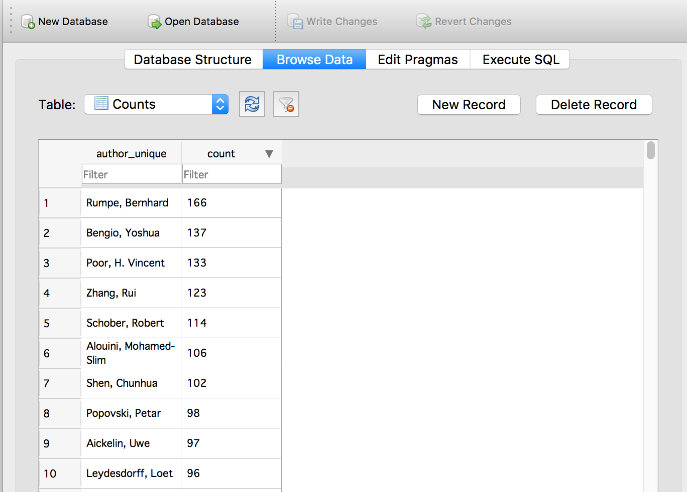

# Machine Learning Engineer Nanodegree
## Capstone Project
Natalya Rapstine
February 28th, 2017

## I. Definition
_(approx. 1-2 pages)_

### Project Overview
Applying to graduate school is a long and tedious process that requires a lot of preparation and research. One of the most important aspects of applying to graduate school is to find a potential advisor or research group that fits an individual interests and background. [Priceton Review](https://www.princetonreview.com/grad-school-advice/application-timeline) recommends starting to research grad schools in May and finalizing the list of prospective graduate schools in September. My goal is to shorten 5 months long research process to a few hours. This project was partly inspired by this [paper from Google](https://static.googleusercontent.com/media/research.google.com/en//pubs/archive/45530.pdf) on how YouTube recommender system that uses deep neural networks and partly by personal frustrating experience of applying to graduate school.

I aim to aid students and working professionals thinking about applying to graduate school in the Computer Science field by building a recommender system for students who are unsure of where to apply based on their current knowledge and interests. This process will automate long and tedious web search to first find schools, narrow down professors and then read through their recent publications. To build a recommender system that outputs ordered suitable professors given student's interests in a form of key words so that the student can be confident that there is a match between what research group/professor is publishing, I recast the problem as a multiclass classification problem. The successful classifier model will be trained to identify which publication belongs to which author. Then given student's interests in terms of key words input, our model will predict the most probable authors. This project focuses on building a successful classifier using Convolutional Neural Networks (CNN) against a Logistic Regression benchmark model.


**Datasets and Inputs**

The website [arXiv.org](https://arxiv.org/) provides open access to over 1 million research publications STEM fields which are suitable for my database of publications in the field of Computer Science.

The first step is to gather a large dataset of openly available academic abstracts published in recent years in Computer Science field. The raw data contains abstract text with corresponding article authors' as its label.


### Problem Statement
The problem I am solving can be thought of as a multiclass classification with each professor being a distinct class. My goal is to accurately predict what abstracts are classified to which author. I will first build a logistic regression model then compare its results with a CNN model.


### Metrics
To evaluate the performance of the benchmark and solution classifier models, I will use the [accuracy score metric](http://scikit-learn.org/stable/modules/generated/sklearn.metrics.accuracy_score.html) on the test data that the model has not seen while training.

The accuracy score computes the fraction of correctly predicted samples. The lowest possible accuracy score is 0 and the highest is 1. Accuracy is computed as follows:
$$
accuracy(y, \hat{y} ) = \frac{1}{N} \sum_i  1(\hat{y_i} = y_i)
$$
where *i* is the sample index, *y* is the true label, *y hat* is the predicted class, *N* is the number of samples, and *1* is the indicator function. 


## II. Analysis
_(approx. 2-4 pages)_

### Data Exploration
The full dataset contains 87,587 abstracts from 2/2012 through 2/2017. First, I want to test my convolutional neural network model against benchmark logistic regression model with a much smaller subset of data, using top only authors with 100 or more abstracts. I count the number of articles per author to filter out authors with less than 20 abstracts assuming that 20 publications will be sufficient to train and test the classifier. Overall, there are 107,947 authors with the article count ranging from 166 to 1. If I limit the minimum number of articles per author to 10 then there are 4027 authors. If I limit the minimum number of articles per author to 20 then there are 922 authors.

But for simplicity and computational time sake, `cnn.py` Python script limits the number of authors to 10 and compares logistic regression benchmark and CNN models as a proxy to larger number of classes and amount of data.

I use Pandas library to build a dataframe with one column containing the author and the second column - abstract text. In the database, we might have several authors who collaborated on the publication. So, we need to split the authors and then append the author name and abstract text into one row of a big Pandas dataframe. We end up with 1772 abstracts in the dataframe among these top 10 authors.

We can count the number of publications per author to make sure the counts correspond to what we see in the database. 



As expected, Bernhard Rumpe is the top author with 166 publications and Loet Leydesdorff is the tenth author with 96 publications in the database.

```
Rumpe, Bernhard          166
Bengio, Yoshua           137
Poor, H. Vincent         133
Zhang, Rui               123
Schober, Robert          114
Alouini, Mohamed-Slim    106
Shen, Chunhua            102
Popovski, Petar           98
Aickelin, Uwe             97
Leydesdorff, Loet         96
```


**PCA**

I also carry out Principle Component Analysis of the data to try and reduce the dimensionality of the data. However, the first two PCA components only account for about 6 percent of variance in the data. So visualizing the scatter matrix of the first two components would produce randomly distributed points with points not clustering together for a particular label.


### Exploratory Visualization

For each document, we count the frequency of each word stem in all abstracts, delete [English stop words](http://xpo6.com/list-of-english-stop-words/)  and plot as a Pareto chart. The word stems are plotted in decreasing order on the x-axis with the y-axis showing the hit count of most frequent word stems. The visualization helps us get a sense of vocabulary of the corpus that classification algorithms will use to distinguish one author from another.


Thus, we see that the most frequent word stems in all abstracts are "model", "propos", "use", "network", and "result" which makes sense given that the abstracts are technical abstracts from Computer Science field that talk about modeling and results.

We can also visualize the word stem frequency as a word cloud. With a word cloud graphic, we get a visual representation of the corpus vocabulary with more frequent words plotted in larget fonts than less frequenty used. 


Again, we see word stems such as "problem", "paper", "perform", "inform", "base", "user" and in smaller fonts, "data", "time", "algorithm", "code", and "function".


### Algorithms and Techniques

**Train/Test split**

As with any machine learning application, we want to split our data into training and testing datasets. I used StratifiedShuffleSplit to split the data and labels. After splitting, the training set is 1054 samples and the testing set is 118 samples.


### Benchmark
For the benchmark model, we build a Logistic Regression model due to its simplicity and easy interpretation. The benchmark perform okay with the accuracy score on the test dataset of 0.6017.


## III. Methodology
_(approx. 3-5 pages)_

### Data Preprocessing
For this step, `database.py` Python script scapes abstract text and the corresponding authors' names from the website by looping over publications from February, 2017 back to February, 2012 to collect 5 years worth of abstracts and store the data in sqlite database `Articles` so I would only have to do this once and then work with the database. The raw data needs to be preprocessed to be suitable for classification. As a standard [Natural Language Processing workflow](https://www.kaggle.com/c/word2vec-nlp-tutorial/details/part-1-for-beginners-bag-of-words) text cleaning step, I convert the text words to lower case, remove the digits and punctuation and then stem the words using Snowball Stemmer before storing preprocessed text in the database.

Working with the Articles databse, `count_db.py` Python script counts the number of publications per author and writes the results in sqlite table `Counts`. Next, I can sort the authors by the number of publications or filter out authors that only have a few publications.

For a CNN model, we want to make sure all the documents are the same length meanining they contain the same amount of words. The longest abstract has 319 words. So, we pad shorter documents to be the same length as the longest document. 

Instead of dealing with text directly, we want to build a vocabulary of words and then map words to index to convert text to integer vectors for input to a CNN model. We first count the words, build an index and then a mapping from index to a word. The size of our vocabulary is the total number of unique words which is 7,247 words. The input data is now converted into integer vectors with the length of 319 for each abstract.

We want to encode the labels (authors' names) as one-hot vectors to represent true labels in the CNN model. First, we convert labels to factors and then use LabelBinarizer function from sklearn.preprocessing library to convert labels to 10-dimensional one-hot vectors.


### Implementation
I used TensorFlow to build a multi-layer convolutional network. The first layer is the embedding layer with a user defined embedding size of 500. The second layer is a convolution and pooling layer with three different filter lengths of 3, 4, and 5 that are then combined and a user defined number of filters parameter equal to 500.  The pooling filters out the maximum value for each convolution to reduce the size of the layer. During training, we use Adam Optimizer to minimize the objective function.

To prune the network and reduce overfitting, dropout is added during training that disables the neurons that are less than 0.5 probability. The last layer is fully-connected layer with the softmax output classification. 


### Refinement
For my initial solution, I built a Pandas dataframe with the word stems as columns and authors as rows. 

|          | word 1    | word 2    | word n    |
| -------- | --------- | --------- | --------- |
| author 1 | frequency | frequency | frequency |
| author 2 | frequency | frequency | frequency |
| author m | frequency | frequency | frequency |

Then I scaled the word count with frequency-inverse weighting, putting more weight on words that occur frequently within the abstract but not so frequently in the whole corpus. I used TfidVectorizer function from sklearn.feature_extraction library to build the matrix of vectorized text words and used that as an input to the classifier models. But I never acheived an accuracy over 50-60% for the test data. 

So, I decided to use a simpler input dataset with less processing and weighting as input to my CNN model. Now, my input is a vector built from mapping words to index based on the corpus vocabulary which resulted in great improvement to the CNN model accuracy. 


## IV. Results
_(approx. 2-3 pages)_

### Model Evaluation and Validation
In this section, the final model and any supporting qualities should be evaluated in detail. It should be clear how the final model was derived and why this model was chosen. In addition, some type of analysis should be used to validate the robustness of this model and its solution, such as manipulating the input data or environment to see how the model’s solution is affected (this is called sensitivity analysis). Questions to ask yourself when writing this section:
- _Is the final model reasonable and aligning with solution expectations? Are the final parameters of the model appropriate?_
- _Has the final model been tested with various inputs to evaluate whether the model generalizes well to unseen data?_
- _Is the model robust enough for the problem? Do small perturbations (changes) in training data or the input space greatly affect the results?_
- _Can results found from the model be trusted?_


The CNN model achieves the accuracy of 0.93 on the test dataset.


### Justification
In this section, your model’s final solution and its results should be compared to the benchmark you established earlier in the project using some type of statistical analysis. You should also justify whether these results and the solution are significant enough to have solved the problem posed in the project. Questions to ask yourself when writing this section:
- _Are the final results found stronger than the benchmark result reported earlier?_
- _Have you thoroughly analyzed and discussed the final solution?_
- _Is the final solution significant enough to have solved the problem?_


## V. Conclusion
_(approx. 1-2 pages)_

### Free-Form Visualization
In this section, you will need to provide some form of visualization that emphasizes an important quality about the project. It is much more free-form, but should reasonably support a significant result or characteristic about the problem that you want to discuss. Questions to ask yourself when writing this section:
- _Have you visualized a relevant or important quality about the problem, dataset, input data, or results?_
- _Is the visualization thoroughly analyzed and discussed?_
- _If a plot is provided, are the axes, title, and datum clearly defined?_

### Reflection
In this section, you will summarize the entire end-to-end problem solution and discuss one or two particular aspects of the project you found interesting or difficult. You are expected to reflect on the project as a whole to show that you have a firm understanding of the entire process employed in your work. Questions to ask yourself when writing this section:
- _Have you thoroughly summarized the entire process you used for this project?_
- _Were there any interesting aspects of the project?_
- _Were there any difficult aspects of the project?_
- _Does the final model and solution fit your expectations for the problem, and should it be used in a general setting to solve these types of problems?_

### Improvement
In this section, you will need to provide discussion as to how one aspect of the implementation you designed could be improved. As an example, consider ways your implementation can be made more general, and what would need to be modified. You do not need to make this improvement, but the potential solutions resulting from these changes are considered and compared/contrasted to your current solution. Questions to ask yourself when writing this section:
- _Are there further improvements that could be made on the algorithms or techniques you used in this project?_
- _Were there algorithms or techniques you researched that you did not know how to implement, but would consider using if you knew how?_
- _If you used your final solution as the new benchmark, do you think an even better solution exists?_

-----------

**Before submitting, ask yourself. . .**

- Does the project report you’ve written follow a well-organized structure similar to that of the project template?
- Is each section (particularly **Analysis** and **Methodology**) written in a clear, concise and specific fashion? Are there any ambiguous terms or phrases that need clarification?
- Would the intended audience of your project be able to understand your analysis, methods, and results?
- Have you properly proof-read your project report to assure there are minimal grammatical and spelling mistakes?
- Are all the resources used for this project correctly cited and referenced?
- Is the code that implements your solution easily readable and properly commented?
- Does the code execute without error and produce results similar to those reported?
